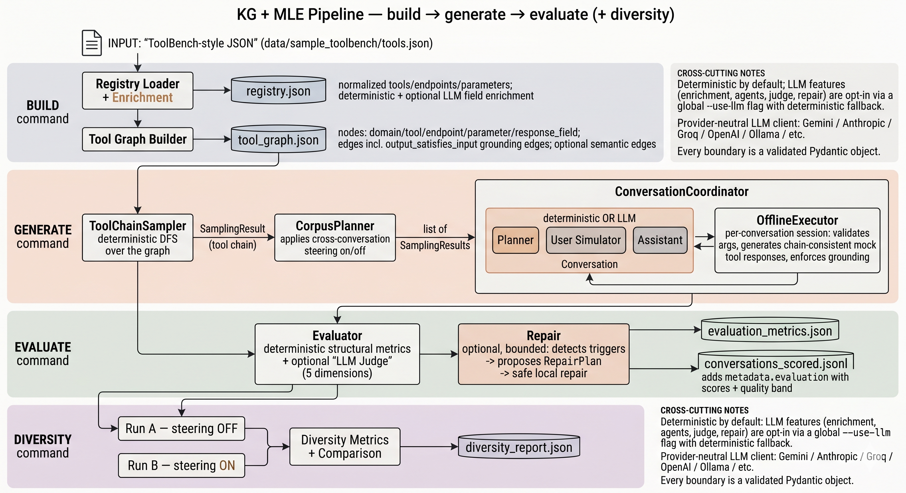

# KG MLE Offline Tool-Use Generator

This repository contains a production-oriented MVP for the SAP offline KG + MLE exercise.



Architecture and design rationale are in [DESIGN.md](DESIGN.md). A 3-record
slice of a real seed-42 run (generated, scored, and metrics) lives in
[`docs/sample_outputs/`](docs/sample_outputs) so you can see the output shape
without running anything.

## Quickstart

```powershell
uv venv .venv
uv pip install -e ".[dev]"
kgmle --help
```

The implementation uses a curated ToolBench-style fixture in `data/sample_toolbench/tools.json`.

Common workflow:

```powershell
kgmle build
kgmle generate --count 10 --seed 42
kgmle evaluate --input data/outputs/conversations.jsonl --output data/outputs/evaluation_metrics.json
```

`kgmle evaluate` writes the metrics JSON and a scored JSONL next to it by
default. The scored JSONL contains the original conversations with
`metadata.evaluation` populated.

Optional hosted judge:

```powershell
kgmle --use-llm evaluate --max-llm-judge-records 10
```

`--use-llm` is the global switch for optional hosted-model features. The
older `evaluate --llm-judge` flag remains supported for judge-only runs.

For a full 100-record scored dataset:

```powershell
kgmle build --semantic-graph --semantic-backend local
kgmle generate --count 100 --seed 42 --allow-semantic-edges
kgmle --use-llm evaluate --repair --max-llm-judge-records 10
```

The raw generated JSONL is useful for debugging. The scored JSONL produced by
`evaluate` is the training/evaluation-ready dataset because it includes
`metadata.evaluation` with deterministic metrics, optional LLM judge scores,
quality band, and repair metadata.

Optional bounded repair pass:

```powershell
kgmle evaluate --repair --repair-threshold 8.0
kgmle --use-llm evaluate --repair --repair-threshold 8.0
```

Diversity experiment:

```powershell
kgmle diversity --count 100 --seed 42
kgmle --use-llm diversity --count 100 --seed 42 --max-llm-judge-records 10
```

## 100-sample run (seed 42, deterministic agents + judge)

```powershell
kgmle build --artifacts-dir artifacts
kgmle generate --count 100 --seed 42 --artifacts-dir artifacts --output data/outputs/conversations.jsonl
kgmle evaluate --input data/outputs/conversations.jsonl --output data/outputs/evaluation_metrics.json --repair
```

Measured stats from that run:

| Metric | Value |
|---|---|
| records generated / failures | 100 / 0 |
| multi-step (≥3 calls) **and** multi-tool (≥2 tools) | 81% |
| tool-call count distribution | 2:19, 3:36, 4:31, 5:14 |
| message-count distribution | 6:11, 8:28, 10:32, 12:21, 14:8 |
| conversations with a clarification turn | 47 |
| distinct domains covered | 9 / 9 |
| mean deterministic score | 10.0 / 10 |
| schema valid rate | 100% |
| tool response coverage | 100% |
| usable-for-training rate | 100% |
| repair attempts needed | 0 |

The 81% multi-step+multi-tool share clears the assignment's 50–60% target,
lengths are varied (2–5 tool calls; 6–14 messages), and 47/100 conversations
include a natural clarification turn before tool calling.

**LLM judge note.** The judge integration works end-to-end (`--use-llm
evaluate`), but a full 100-record run on Gemini's free tier hits a `HTTP 429`
quota wall after ~2 calls. The pipeline contains this gracefully: each
quota-limited record stores `metadata.evaluation.llm_judge = {"error": "..."}`
and deterministic metrics stay intact. A real-provider 100-record judge run
therefore needs a paid quota or a slower rate-limited pass; deterministic
evaluation is the offline default. The E2E test (`tests/e2e/test_pipeline_100.py`)
fakes the judge at the provider boundary so the integration path is verified
in CI without consuming quota.

## Output format

`generate` writes one JSON object per line. Abbreviated generated record
(a real 2-step grounded conversation, `conv_42_00001`):

```json
{
  "conversation_id": "conv_42_00001",
  "messages": [
    {"role": "user", "content": "I'd like help to find tournaments for a game, then follow up with 1 more action(s) across events, gaming."},
    {"role": "assistant", "content": "Before I proceed, could you tell me which game_id to use for get tournament schedule?",
     "clarification_target_step": 0, "clarification_target_parameter": "game_id"},
    {"role": "user", "content": "For game_id, use any_game_id."},
    {"role": "assistant", "content": null, "tool_calls": [
      {"endpoint_id": "gaming/get_tournament_schedule", "arguments": {"game_id": "any_game_id"}, "call_confidence": 1.0}]},
    {"role": "tool", "endpoint": "gaming/get_tournament_schedule",
     "content": {"tournament_id": "trn_s1wjo3", "start_time": "2026-04-11T09:00", "venue": "Old Town"}},
    {"role": "assistant", "content": null, "tool_calls": [
      {"endpoint_id": "events/create_calendar_event",
       "arguments": {"title": "title_value", "start_time": "2026-04-11T09:00", "location": "Old Town", "event_type": "event_type_value"},
       "call_confidence": 1.0}]},
    {"role": "tool", "endpoint": "events/create_calendar_event",
     "content": {"calendar_event_id": "cal_coofdh", "status": "Status 72"}},
    {"role": "assistant", "content": "Done. I completed: get tournament schedule, create calendar event."}
  ],
  "plan": { "...": "the Plan that drove generation (intent, per-step parameter plans, ambiguous_step_indices)" },
  "metadata": {
    "seed": 42000127,
    "original_chain": ["gaming/get_tournament_schedule", "events/create_calendar_event"],
    "final_chain":    ["gaming/get_tournament_schedule", "events/create_calendar_event"],
    "n_tool_calls": 2,
    "domains": ["events", "gaming"],
    "tools_visited": ["gaming_catalog", "events_calendar"],
    "transition_summary": [
      {"source": "gaming/get_tournament_schedule", "target": "events/create_calendar_event",
       "advance_type": "grounded", "parameter": "start_time"}
    ],
    "clarifications_taken": [
      {"step_index": 0, "parameter_name": "game_id", "initiated_by": "planner"}
    ],
    "deviations_accepted": [],
    "deviations_rejected": []
  }
}
```

Note the **grounded chaining**: `gaming/get_tournament_schedule` returns
`start_time: "2026-04-11T09:00"`, and the next call's `start_time` argument
reuses that exact value (the `transition_summary` records it as a `grounded`
edge on `start_time`). The executor would reject a hallucinated value.

`evaluate` writes the same records to a **scored JSONL** with a
`metadata.evaluation` block added:

```json
"evaluation": {
  "schema_valid": true,
  "role_sequence_valid": true,
  "tool_response_coverage": 1.0,
  "chain_completion": 1.0,
  "error_free_trace": 1.0,
  "deterministic_score": 10.0,
  "llm_judge": null,
  "quality_band": "gold",
  "usable_for_training": true
}
```

When `--use-llm` is set, `llm_judge` carries the 5-dimension score object
(or `{"error": "..."}` if the provider failed for that record):

```json
"llm_judge": {
  "task_completion": 9.0, "tool_trace_validity": 9.0, "argument_grounding": 9.0,
  "response_grounding": 9.0, "naturalness": 8.0, "overall_score": 9.0,
  "confidence": 9.0, "issues": [], "rationale": "..."
}
```

`evaluate` also writes a **metrics JSON** with corpus-level aggregates:

```json
{
  "summary": {
    "conversation_count": 100,
    "mean_deterministic_score": 10.0,
    "mean_chain_completion": 1.0,
    "mean_tool_response_coverage": 1.0,
    "schema_valid_rate": 1.0,
    "llm_judged_count": 0,
    "mean_llm_overall_score": null,
    "usable_for_training_rate": 1.0
  },
  "repair_summary": {"enabled": true, "attempted": 0, "repaired": 0, "failed": 0, "rejected": 0, "regenerated": 0, "status_counts": {}},
  "records": [ { "conversation_id": "conv_42_00000", "deterministic_score": 10.0, "quality_band": "gold", "usable_for_training": true, "...": "..." } ]
}
```

The `diversity` command writes a `diversity_report.json` with `run_a_no_steering`,
`run_b_steering`, and a `comparison` block of per-metric deltas; see DESIGN.md §10
for the metric definitions and the steering-on/off result table.

## Tests

```powershell
.\.venv\Scripts\python.exe -m pytest tests -m "not live"
```

The E2E test (`tests/e2e/test_pipeline_100.py`) builds artifacts, generates 100
conversations, evaluates them through the LLM-judge interface with a
deterministic fake provider, and asserts the mean judge score exceeds the
documented threshold (8.0/10).
